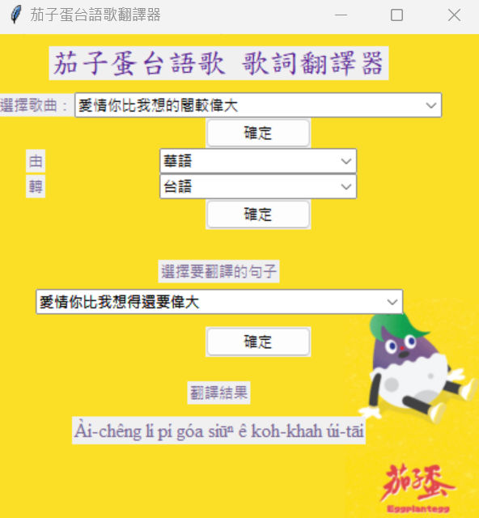

### `Conceptualization`
As an undergraduate student in the Taiwanese literature department, after completing the Introduction to Computing course, I began to contemplate how I could integrate coding skills with my major studies. Thus, I embarked on this small project, hoping to apply it within my field of study.


Users can choose from five songs to translate, allowing them to listen to music while learning Taiwanese simultaneously.


### `Code`
#### `UI Setting`
Using the Tkinter GUI toolkit to create the user interface.
```python
import tkinter as tk
from tkinter import ttk
import csv
```

Designed a window with 400x400 and added a title label, using an EggplantEgg theme for the color scheme (purple-yellow-white). Set the font to Times New Roman.
```python
class LyricsTranslatorApp:
    def __init__(self, root):
        self.root = root
        self.root.title("茄子蛋台語歌翻譯器")
        self.root.geometry('400x400')

        self.bg_image = tk.PhotoImage(file='eggplant.png')  
        self.bg_label = tk.Label(root, image=self.bg_image)
        self.bg_label.place(relwidth=1, relheight=1)

        self.header_label = ttk.Label(root, text='茄子蛋台語歌 歌詞翻譯器', font=('標楷體', 18), foreground='#592693')
        self.header_label.grid(row=0, column=0, columnspan=2, pady=10)

        self.song_label = ttk.Label(root, text='選擇歌曲：', foreground='#766592')
        self.song_label.grid(row=1, column=0)

        self.song_combo = ttk.Combobox(root, state='readonly', width=40)
        self.song_combo.grid(row=1, column=1)

        self.result_button = ttk.Button(root, text='確定', command=self.load_lyrics)
        self.result_button.grid(row=2, column=1)

        self.combo_label1 = ttk.Label(root, text='由', foreground='#766592')
        self.combo_label1.grid(row=3, column=0)

        self.combo1 = ttk.Combobox(root, value=['華語', '台語'], state='readonly')
        self.combo1.grid(row=3, column=1)

        self.combo_label2 = ttk.Label(root, text='轉', foreground='#766592')
        self.combo_label2.grid(row=4, column=0)

        self.combo2 = ttk.Combobox(root, value=['台語', '華語'], state='readonly')
        self.combo2.grid(row=4, column=1)

        self.result_button2 = ttk.Button(root, text='確定', command=self.result)
        self.result_button2.grid(row=5, column=1)

        self.choose_label = ttk.Label(root, text='選擇要翻譯的句子', foreground='#766592')
        self.choose_label.grid(row=6, column=0, pady=(25, 0), columnspan=2)

        self.choose = None

        self.translate_button = ttk.Button(root, text='確定', command=self.translate)
        self.translate_button.grid(row=8, column=1, pady=10)

        self.result_label = ttk.Label(root, text='翻譯結果', foreground='#766592')
        self.result_label.grid(row=9, column=0, pady=10, columnspan=2)

        self.result_text = tk.StringVar()
        self.result_display = ttk.Label(root, textvariable=self.result_text, font=('Times New Roman', 12), foreground='#766592')
        self.result_display.grid(row=10, column=0, columnspan=2)
```

When the user selects a song, the computer automatically reads the corresponding CSV file and stores the Chinese and Taiwanese content in two separate arrays.

#### `Language Translation`
Users can choose to translate from Chinese to Taiwanese or from Taiwanese to Chinese using a dropdown menu.

Based on the selected translation direction, the range of choices is set using the contents of value1 and value2.

After clicking the confirm button, a dropdown menu is generated to select the sentence to be translated.
```python
def result(self):
        combo1_value = self.combo1.get()
        combo2_value = self.combo2.get()
        if combo1_value == '華語':
            choices = self.value1
        elif combo1_value == '台語':
            choices = self.value2
        else:
            return

        if self.choose:
            self.choose.destroy()

        self.choose = ttk.Combobox(root, value=choices, state='readonly', width=40)
        self.choose.grid(row=7, column=0, pady=(5, 0), columnspan=2)

    def translate(self):
        selected_lyrics = self.choose.get()
        if selected_lyrics:
            index = self.value1.index(selected_lyrics) if self.combo1.get() == '華語' else self.value2.index(selected_lyrics)
            taiwanese_lyrics = self.value2[index] if self.combo1.get() == '華語' else self.value1[index]
            self.result_text.set(taiwanese_lyrics)
```
```python
if __name__ == '__main__':
    root = tk.Tk()
    app = LyricsTranslatorApp(root)

    songs = ['浪流連', '愛情你比我想的閣較偉大', '閣愛妳一擺', '這款自作多情', 'Happy!!! 運將情歌']
    app.song_combo['values'] = songs

    root.mainloop()
```

After the user selects the sentence they wish to translate, the corresponding lyrics are located based on their choice and then translated. Depending on the chosen method of translation, the selected lyrics are translated and the results are displayed on the interface.            



While listening to the 2022 Golden Melody Awards Song of the Year, one can also take the opportunity to learn Romanized phonetics. This not only enhances understanding of the lyrics but also improves language skills and cultural knowledge 😊

