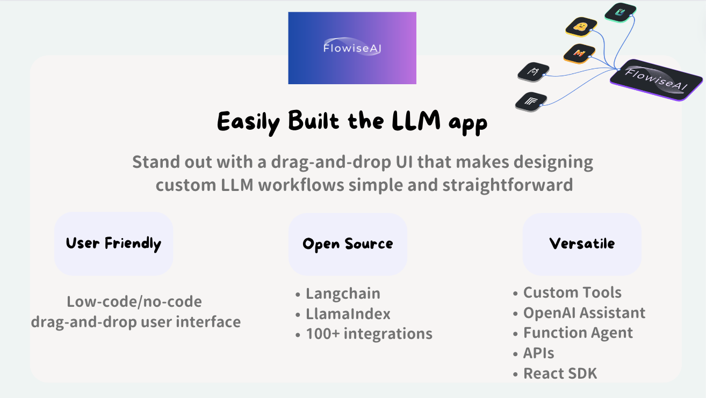
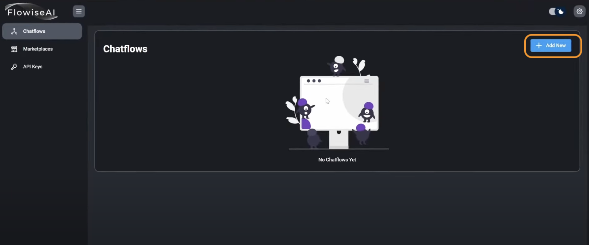

### `Introduction`
#### What is Flowise?
Flowise uses low-code approach that enable developers to manage the whole lifecycle of building LLMs apps in production. From protoyping, evaluation, to iterations.

Built on the foundation of LangChain.js, Flowise offers advanced features to enhance the development process. From LLM orchestration and agent creation to seamless integration via APIs, SDKs, and Embedded Chat, Flowise provides a comprehensive toolkit for building dynamic AI-driven solutions.

#### Key Features of Flowise
* LLM Orchestration: Seamlessly connect LLMs with various components such as memory, data loaders, cache, and moderation tools.
* Agents & Companions: Develop autonomous agents capable of executing diverse tasks.
API, SDK, Embed: Extend functionality and integrate with existing applications through APIs, SDKs, and Embedded Chat.
* Open Source LLMs: Run applications in air-gapped environments with local LLMs, embeddings, and vector databases.
* Supported LLM Frameworks:
    * LangChain
    * LlamaIndex



### `Getting Started`

#### Prerequisite
Latest ([NodeJS](https://nodejs.org/en/download))installed

#### ⚡ Quick Start
1. Install Flowise
``` bash
npm install -g flowise
```
2. Start Flowise
``` bash
npx flowise start
```
3. Open [http://localhost:3000](http://localhost:3000) in the browser.

Enter `npm update -g flows` to update to latest version!

#### Build your first app

1. Create new chat flow by clicking on `Add New` and this will give us blank canva where we can create an AI application.




