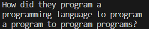
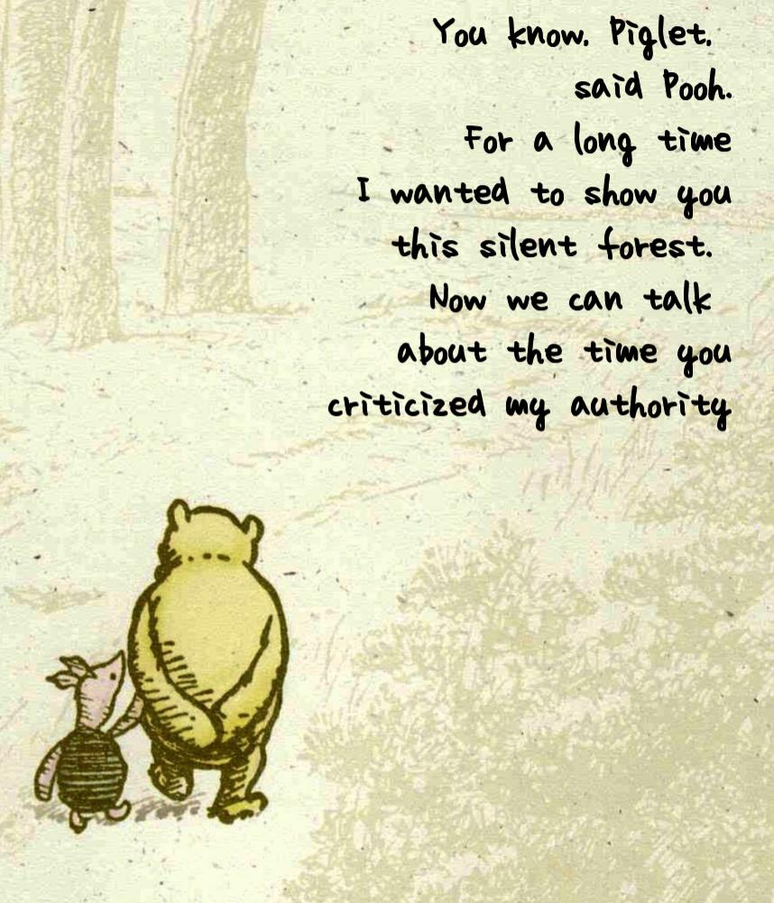
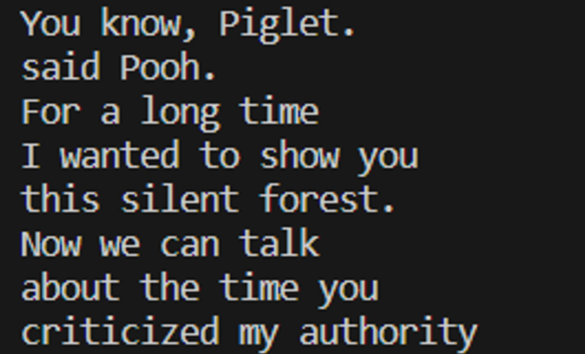
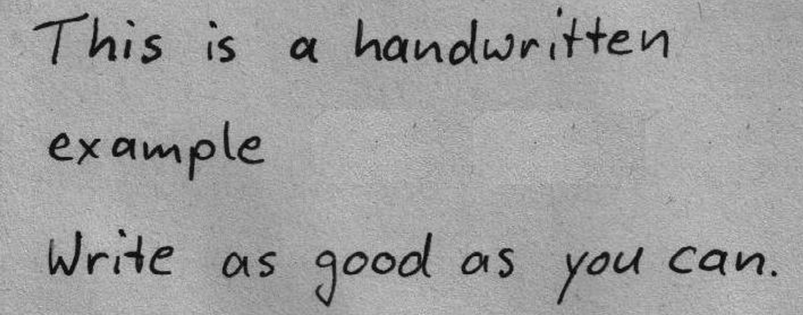
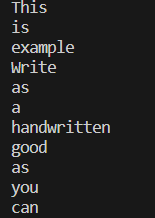
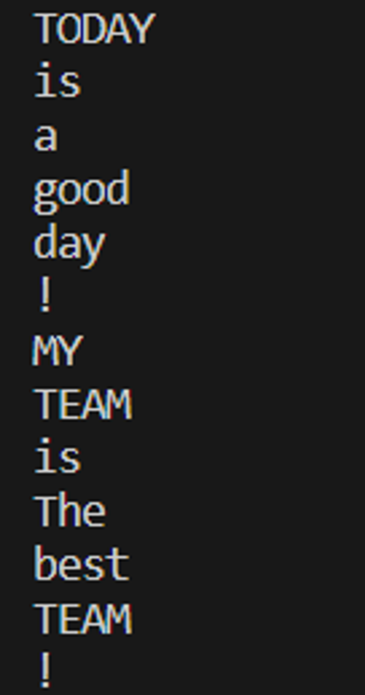

### Introduction

Google Cloud Document AI API and Google Cloud Vision API are both Google Cloud services designed for processing documents and images.


1.Document Processing:

> * Document AI API:  
> Document AI API focuses on processing structured documents, such as PDFs and OCR 
> documents. Its primary functionalities include text extraction, table recognition
> page identification, entity recognition (e.g., identifying dates and amounts in 
> contracts), and more. This makes it suitable for handling business documents like
> contracts, invoices, reports, and others.

> * Vision API:
> Vision API specializes in processing images and pictures. It can recognize 
> objects, faces, scenes, text, and more within images. Its main applications 
> include image classification, facial recognition, OCR text recognition, and more.
> This makes it suitable for image processing applications like image search, facial
> recognition, and automated image analysis.
 
2.Application Scenario:
> * Document AI API: 
> The Document AI API is suitable for business scenarios that involve processing a 
> large volume of structured documents, such as contracts, invoices, and medical 
> records.

> * Vision API: 
> The Vision API is well-suited for applications that require processing images and
> photos, such as image analysis and image search.


### Code Demo

☁️ Cloud Vision
*  Recognize text in pictures
```python
#Detect online images
from google.cloud import vision
def detect_document_text_uri(uri):
    """Detects document text in the file located in Google Cloud Storage or on the Web."""
    client = vision.ImageAnnotatorClient()
    image = vision.Image()
    image.source.image_uri = uri

    response = client.document_text_detection(image=image)
    document = response.full_text_annotation
    
    print(document.text)

    if response.error.message:
        raise Exception(
            "{}\nFor more info on error messages, check: "
            "https://cloud.google.com/apis/design/errors".format(response.error.message)
        )

detect_document_text_uri('https://i.redd.it/2aby2h2mhtpb1.jpg')
```


```python
#Detect local images
def detect_text(path):
    """Detects text in the file."""
    from google.cloud import vision

    client = vision.ImageAnnotatorClient()

    with open(path, "rb") as image_file:
        content = image_file.read()

    image = vision.Image(content=content)

    response = client.text_detection(image=image)
    texts = response.text_annotations
    
    if texts:
        print(texts[0].description)

detect_text("profile path")
```

Click ▶ to expand the examples
<details>
<summary>Example & Result (online images)</summary>

 

</details>

<details>
<summary>Example & Result (local images)</summary>

 

</details>

*  Recognize handwriting in pictures

```python
#Detect text in online images
def detect_document_uri(uri):
    """Detects document features in the file located at the given URL."""
    from google.cloud import vision_v1

    client = vision_v1.ImageAnnotatorClient()

    image = vision_v1.Image()
    image.source.image_uri = uri

    response = client.document_text_detection(image=image)

    for page in response.full_text_annotation.pages:
        for block in page.blocks:
            for paragraph in block.paragraphs:
                for word in paragraph.words:
                    word_text = "".join([symbol.text for symbol in word.symbols])
                    print(word_text)

    if response.error.message:
        raise Exception(
            "{}\nFor more info on error messages, check: "
            "https://cloud.google.com/apis/design/errors".format(response.error.message)
        )

detect_document_uri('https://ocr-demo.abtosoftware.com/uploads/handwritten3.jpg')
```

<details>
<summary>Example & Result (local images)</summary>

 

</details>

<details>
<summary>Example & Result (online images)</summary>

 

</details>


📃 Document AI
```python
from typing import Optional
from google.api_core.client_options import ClientOptions
from google.cloud import documentai

def process_document_sample() -> None:
    # Specify Google Cloud ID & other parameters
    project_id = "your project id"
    location = "us"
    processor_id = "your processor id"
    mime_type = "application/pdf"
    field_mask = "text,entities,pages.pageNumber"  
    processor_version_id = None  # Do not use a specific processor version

    #Input file path
    file_path = input("Please enter the path to the PDF file you want to process: ")

    # Initialize Document AI client
    client = documentai.DocumentProcessorServiceClient()

    if processor_version_id:
        name = client.processor_version_path(
            project=project_id, location=location, processor=processor_id, processor_version=processor_version_id
        )
    else:
        name = client.processor_path(project=project_id, location=location, processor=processor_id)

    
    with open(file_path, "rb") as image:
        image_content = image.read()
    
    raw_document = documentai.RawDocument(content=image_content, mime_type=mime_type)

    request = documentai.ProcessRequest(
        name=name,
        raw_document=raw_document,
        field_mask=field_mask
    )

    result = client.process_document(request=request)
    document = result.document

    print(document.text)

if __name__ == "__main__":
    process_document_sample()
```


> Through exploring these APIs, I learned about their 
> specific applications in handling structured documents and images, and the 
> potential for automating tasks in business and image analysis contexts. 
> Looking ahead, these insights could be applied in developing more efficient 
> document management systems, enhancing data extraction from documents, and 
> improving image-based search and analysis in various industries.


