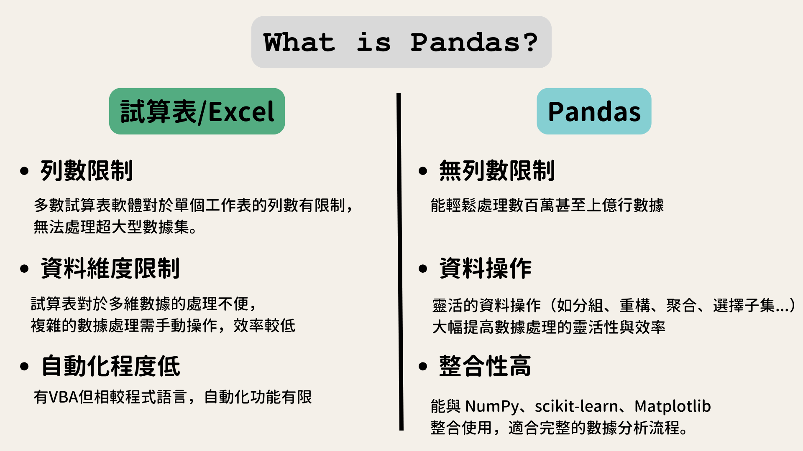
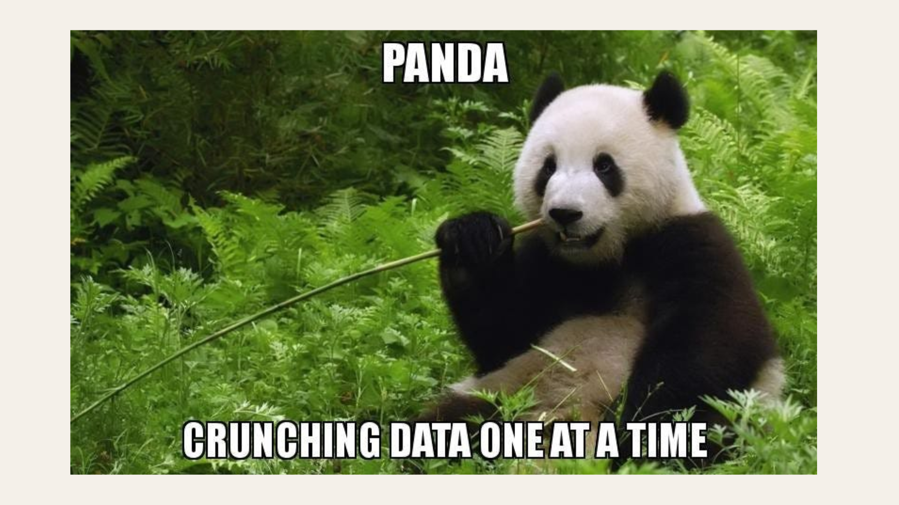
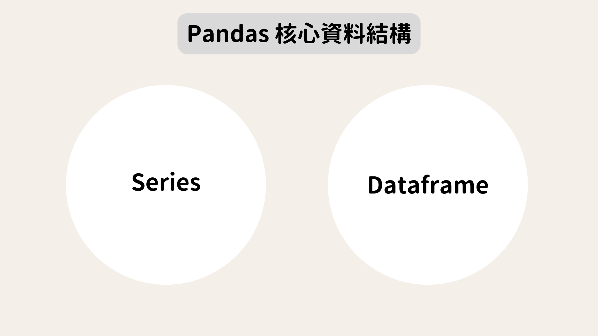
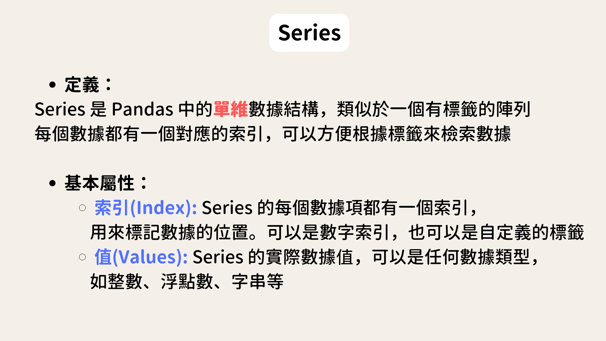

# **WHAT IS PANDAS**
聽到Pandas時你的反應是什麼? 熊貓?功夫熊貓?粉紅色外送平台?


> Pandas是一個在資料科學領域中非常重要的工具。 類似試算表的概念，是一個專門用來處理結構化數據的 Python 套件，尤其在資料分析上，會頻繁使用它來進行數據操作
> 
> Pandas 的出現是為了填補 Excel 或其他試算表工具的不足。
> 舉例來說，Excel 在處理大型數據集時常常會受到列數限制或處理效率的影響，
> 而 Pandas 則能輕鬆應對數百萬甚至上億行的數據。
> Excel 雖然可以用 VBA 做一些自動化處理，但相較於程式語言，這種自動化的程度較低。
>
> Pandas 不僅能進行靈活的數據操作，還可以和 Python 的其他工具（如 NumPy、scikit-learn、Matplotlib）整合，這使得我們可以進行完整的數據分析流程。





**Start Pandas**

會先需要安裝套件，安裝後import pandas 並命名為pd
```python
pip install pandas
import pandas as pd
```
取pandas簡寫pd，但如果要很反骨的用其他方式命名也不是不行啦...


# **Pandas核心資料結構**
Pandas 的核心結構有Series和DataFrame兩種


## **Series**
> Series 是 Pandas 中的單維度數據結構，類似於一個帶有標籤的陣列。我們可以把它想像成 Excel 表格中的一列。每個數據值都有對應的索引，就像每個單元格都有標籤一樣。索引可以是數字（比如 0, 1, 2…），也可以是自定義標籤（比如姓名）。可以透過索引來檢索某一個特定的數據。


創建一個名為 s 的 Series，數據值是 31, 29, 24, 22，對應的索引是 'Anthony', 'Benedict', 'Collin', 'Daphne'。

```python
s = pd.Series([31,29,24,22] , index=['Anthony', 'Benedict', 'Collin', 'Daphne'])
print(s)
```
輸出結果看起來就像是一個標籤和數據的對應關係。

Anthony     31  
Benedict    29  
Collin      24  
Daphne      22  
dtype: int64

**常見的 Series 操作**

**選取數據**：可以透過索引名稱或位置來選取數據。比如你可以選取 s['Anthony'] 或 s[0]，兩者都會返回 31。

```python
print(s['Anthony'])     # 選取索引 'Anthony' 的數據，結果為 31
print(s[0])      # 選取第一個數據，結果為 31
```
31  
31

**數據運算**：Series 支援加減乘除等運算，你可以對整個 Series 進行數值運算，Pandas 會自動保留對應的索引。例如，s + 2 會讓每個數據值都加上 2。
> s + 2       每個數據加 2  
> s.median()   計算中位數  
> s.max()        找到最大值  

## **DataFrame**

> DataFrame 是 Pandas 中的二維度數據結構，類似於完整的試算表資料，有欄和列。
>
> 與 Series 不同，DataFrame 可以有多個列，每一列都可以有不同的數據類型。DataFrame 是由行和列組成的，每個行和列都有自己的標籤。


