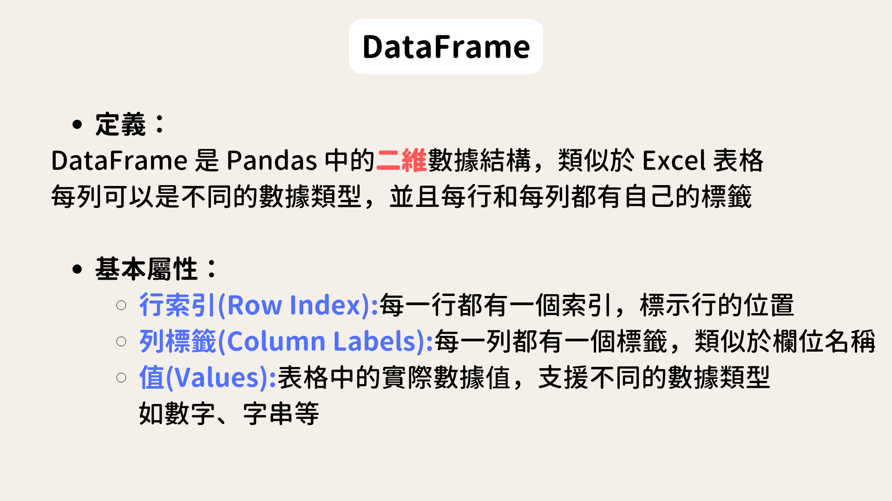
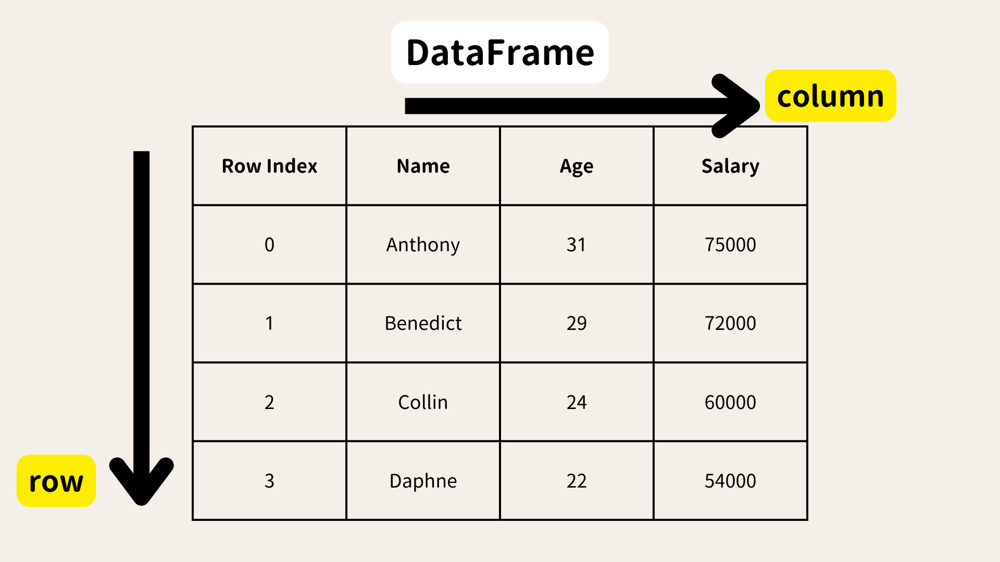
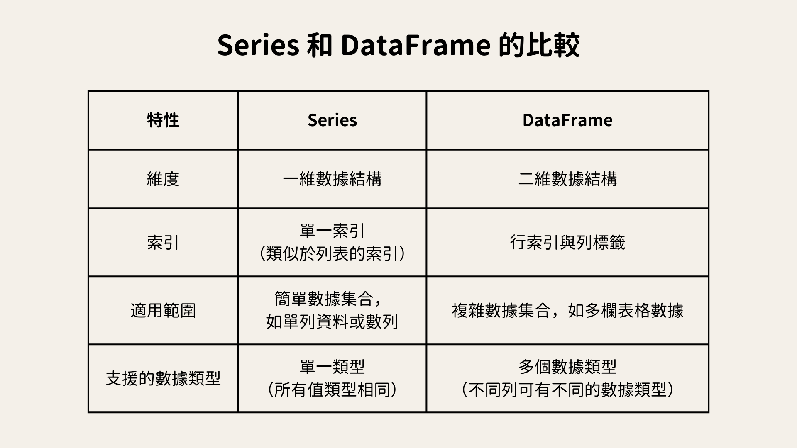

# **WHAT IS PANDAS**
聽到Pandas時你的反應是什麼? 熊貓?功夫熊貓?粉紅色外送平台?


> Pandas是一個在資料科學領域中非常重要的工具。 類似試算表的概念，是一個專門用來處理結構化數據的 Python 套件，尤其在資料分析上，會頻繁使用它來進行數據操作
> 
> Pandas 的出現是為了填補 Excel 或其他試算表工具的不足。
> 舉例來說，Excel 在處理大型數據集時常常會受到列數限制或處理效率的影響，
> 而 Pandas 則能輕鬆應對數百萬甚至上億行的數據。
> Excel 雖然可以用 VBA 做一些自動化處理，但相較於程式語言，這種自動化的程度較低。
>
> Pandas 不僅能進行靈活的數據操作，還可以和 Python 的其他工具（如 NumPy、scikit-learn、Matplotlib）整合，這使得我們可以進行完整的數據分析流程。


**Start Pandas**

會先需要安裝套件，安裝後import pandas 並命名為pd
```python
pip install pandas
import pandas as pd
```
取pandas簡寫pd，但如果要很反骨的用其他方式命名也不是不行啦...


# **Pandas核心資料結構**
Pandas 的核心結構有Series和DataFrame兩種


## **Series**
> Series 是 Pandas 中的單維度數據結構，類似於一個帶有標籤的陣列。我們可以把它想像成 Excel 表格中的一列。每個數據值都有對應的索引，就像每個單元格都有標籤一樣。索引可以是數字（比如 0, 1, 2…），也可以是自定義標籤（比如姓名）。可以透過索引來檢索某一個特定的數據。


創建一個名為 s 的 Series，數據值是 31, 29, 24, 22，對應的索引是 'Anthony', 'Benedict', 'Collin', 'Daphne'。

```python
s = pd.Series([31,29,24,22] , index=['Anthony', 'Benedict', 'Collin', 'Daphne'])
print(s)
```
輸出結果看起來就像是一個標籤和數據的對應關係。

```
Anthony     31  
Benedict    29  
Collin      24  
Daphne      22  
dtype: int64
```

**常見的 Series 操作**

**選取數據**：可以透過索引名稱或位置來選取數據。比如你可以選取 s['Anthony'] 或 s[0]，兩者都會返回 31。

```python
print(s['Anthony'])     # 選取索引 'Anthony' 的數據，結果為 31
print(s[0])      # 選取第一個數據，結果為 31
```
31  
31

**數據運算**：Series 支援加減乘除等運算，你可以對整個 Series 進行數值運算，Pandas 會自動保留對應的索引。例如，s + 2 會讓每個數據值都加上 2。
> s + 2       每個數據加 2  
> s.median()   計算中位數  
> s.max()        找到最大值  

## **DataFrame**

> DataFrame 是 Pandas 中的二維度數據結構，類似於完整的試算表資料，有欄和列。
>
> 與 Series 不同，DataFrame 可以有多個列，每一列都可以有不同的數據類型。DataFrame 是由行和列組成的，每個行和列都有自己的標籤。
>
> **pd.DataFrame(字典) ，以字典的資料為底，建立dataframe**





```python
import pandas as pd

data = { 'Name': ['Anthony', 'Benedict', 'Collin', 'Daphne'],
        'Age': [31,29,24,22],
        'Salary': [75000,72000,60000,54000] }

df = pd.DataFrame(data)
print(df)
```
|       |   Name    | Age | Salary |
|-------|-----------|-----|--------|
|   0   | Anthony   |  31 | 75000  |
|   1   | Benedict  |  29 | 72000  |
|   2   | Collin    |  24 | 60000  |
|   3   | Daphne    |  22 | 54000  |


創建了一個 DataFrame，包含了三個欄位：Name，Age 和 Salary。每一列數據都可以有不同的類型，比如 Age 是整數，而 Name 是字串

要選取 DataFrame 中的數據，我們可以使用列的名稱來選取特定的數據。  
舉個例子：  
我們用 `df['Name']` 選取了 DataFrame 中的 `Name` 列  
這就像是提取 Excel 表中的某一列。你可以選取多列，使用 `df[['Name', 'Salary']]` 選取 

新增一列的方法很簡單，只需要指定列名，然後為每一行賦值  
* 新增列
```python
df['Bonus'] = [5000, 6000, 7000 ,8000]
print(df)
```
|       |   Name    | Age | Salary | Bonus |
|-------|-----------|-----|--------|-------|
|   0   | Anthony   |  31 | 75000  |  5000 |
|   1   | Benedict  |  29 | 72000  |  6000 |
|   2   | Collin    |  24 | 60000  |  7000 |
|   3   | Daphne    |  22 | 54000  |  8000 |


* 新增行資料，使用 pd.concat()
```python
# Pandas 1.4.0 版本之後，append() 方法已被棄用
new_row = pd.DataFrame({
    "Name": ["Ella"],
    "Age": [25],
    "Salary": [64500],
    "Bonus": [1000]
})

df = pd.concat([df, new_row], ignore_index=True) # pd.concat()：將原本的 DataFrame 與新增的資料行結合在一起。ignore_index=True 用於重新索引，使新行的索引從 0 開始連續排列。
print(df)
```
|       |   Name    | Age | Salary | Bonus |
|-------|-----------|-----|--------|-------|
|   0   | Anthony   |  31 | 75000  |  5000 |
|   1   | Benedict  |  29 | 72000  |  6000 |
|   2   | Collin    |  24 | 60000  |  7000 |
|   3   | Daphne    |  22 | 54000  |  8000 |


* 刪除列
```python
df1 = df.drop (columns=['Bonus'] )
print(df1)
```
|       |   Name    | Age | Salary |
|-------|-----------|-----|--------|
|   0   | Anthony   |  31 | 75000  |
|   1   | Benedict  |  29 | 72000  |
|   2   | Collin    |  24 | 60000  |
|   3   | Daphne    |  22 | 54000  |
|   4   | Ella      |  25 | 64500  |
 

基本上不會刪除到原始資料，若要顯示出刪除後的結果，需要宣告新變數來存取執行結果



# **資料集實戰練功**

## **匯入實戰資料**

*出來吧 神奇寶貝!*


[Pokemon DataSet](https://www.kaggle.com/datasets/rounakbanik/pokemon)

**匯入資料**
* pd.read_csv()：用來匯入 CSV 格式的資料
* pd.read_excel()：用來匯入 Excel 格式的資料

```python
import pandas as pd
df = pd.read_csv("檔案路徑")
```

## **檢索資料**

* df.info()：顯示 DataFrame 的基本資訊，包括列數、欄數和每個欄位的數據類型，查看資料的資訊，包括欄位、數據型態、缺失值等
* df.head()：取得最前面的n筆資料
* df.tail()：取得最後面的n筆資料
* df.columns：列出欄位名稱
* df.describe()：產生統計摘要，如平均值、最大值、標準差等。
* df.shape：返回資料的行數與列數，了解資料的大小

```python
df.info()
```

```
<class 'pandas.core.frame.DataFrame'>
RangeIndex: 800 entries, 0 to 799
Data columns (total 13 columns):
 #   Column      Non-Null Count  Dtype 
---  ------      --------------  ----- 
 0   #           800 non-null    int64 
 1   Name        800 non-null    object
 2   Type 1      800 non-null    object
 3   Type 2      414 non-null    object
 4   Total       800 non-null    int64 
 5   HP          800 non-null    int64 
 6   Attack      800 non-null    int64 
 7   Defense     800 non-null    int64 
 8   Sp. Atk     800 non-null    int64 
 9   Sp. Def     800 non-null    int64 
 10  Speed       800 non-null    int64 
 11  Generation  800 non-null    int64 
 12  Legendary   800 non-null    bool  
dtypes: bool(1), int64(9), object(3)
memory usage: 75.9+ KB
```

```python
print(df.describe())
```

```
                #      Total          HP      Attack     Defense     Sp. Atk  \
count  800.000000  800.00000  800.000000  800.000000  800.000000  800.000000   
mean   362.813750  435.10250   69.258750   79.001250   73.842500   72.820000   
std    208.343798  119.96304   25.534669   32.457366   31.183501   32.722294   
min      1.000000  180.00000    1.000000    5.000000    5.000000   10.000000   
25%    184.750000  330.00000   50.000000   55.000000   50.000000   49.750000   
50%    364.500000  450.00000   65.000000   75.000000   70.000000   65.000000   
75%    539.250000  515.00000   80.000000  100.000000   90.000000   95.000000   
max    721.000000  780.00000  255.000000  190.000000  230.000000  194.000000   

          Sp. Def       Speed  Generation  
count  800.000000  800.000000   800.00000  
mean    71.902500   68.277500     3.32375  
std     27.828916   29.060474     1.66129  
min     20.000000    5.000000     1.00000  
25%     50.000000   45.000000     2.00000  
50%     70.000000   65.000000     3.00000  
75%     90.000000   90.000000     5.00000  
max    230.000000  180.000000     6.00000
```

```python
#檢視欄位
print(df.columns)
```

```
Index(['#', 'Name', 'Type 1', 'Type 2', 'Total', 'HP', 'Attack', 'Defense',
       'Sp. Atk', 'Sp. Def', 'Speed', 'Generation', 'Legendary'],
      dtype='object')
```

```python
#檢視前10筆資料
df.head(n=10)
```
