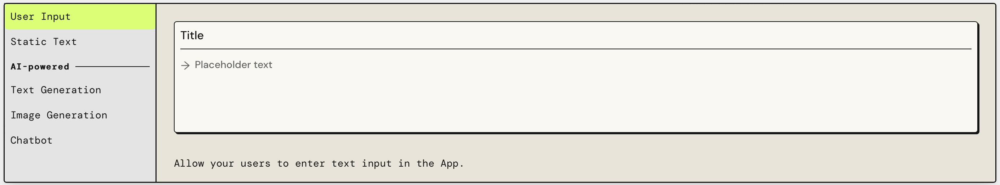

### Introduction
#### What is PartyRock?
> Amazon PartyRock is an environment that allows users to experiment with and build
> generative AI-powered applications without any coding, focusing on skills like 
> prompt engineering. It’s a fast and fun way to learn about generative AI 🕹️

#### How to use AWS PartyRock?  How does it works?
> PartyRock uses foundation models from Amazon Bedrock to turn your ideas into 
> working PartyRock apps. The platform then uses this description to create the 
> application, providing widgets and tools based on the entered prompt.
> To get the most out of the PartyRock experience, you can do the following:
> 1. Get started by creating a PartyRock app. 
> 2. Build the app by editing UI elements called widgets. You can change widget 
> prompts so that they connect to each other and accomplish different things.
> 3. Take the next steps and publish your PartyRock app and share it with others.

### Building the app
#### How does the PartyRock create an app?
> The app builder is a generative AI tool within PartyRock that can make different 
> apps for you through a process called inference. 
> * App Creation: PartyRock uses a generative AI tool to create applications based 
> on user descriptions, leveraging Amazon Bedrock's foundation models.
> * Widget Assembly: It generates instructions for app construction, detailing 
> necessary components and UI elements like text boxes and buttons.
> * Customization: In the app editor, users can customize by adjusting widget sizes
> positions, and functions to fulfill the intended app purpose.

#### What is a widget?
> Widgets in PartyRock are UI elements that can interact, display content, and 
> process input. They can be linked to create complex outputs, like text or images,
> using AI-driven prompts and data from other widgets. These AI-powered widgets 
> leverage foundation models for content generation.

#### Types of widgets
> * 3 AI-powered widgets: Image generation, Chatbot, and Text generation. 

> You can edit AI-powered widgets to connect them to other widgets and make their 
> output change.
> * 2 other widgets: User input and Static text. 

> The user input widget allow users to change output when you connect it to 
> AI-powered widgets. 
> The static text widget provides a place for text descriptions.

