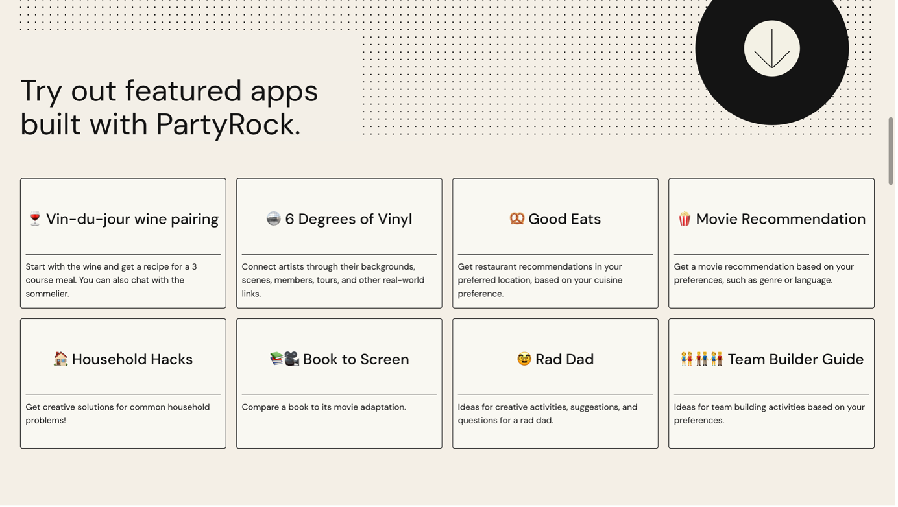

### Introduction
What is PartyRock?
> Amazon PartyRock is an environment that allows users to experiment with and build
> generative AI-powered applications without any coding, focusing on skills like 
> prompt engineering. It’s a fast and fun way to learn about generative AI 🕹️

How to use AWS PartyRock? How does it works?
> PartyRock uses foundation models from Amazon Bedrock to turn your ideas into 
> working PartyRock apps. The platform then uses this description to create the 
> application, providing widgets and tools based on the entered prompt.
> To get the most out of the PartyRock experience, you can do the following:
> 1. Get started by creating a PartyRock app. 
> 2. Build the app by editing UI elements called widgets. You can change widget 
> prompts so that they connect to each other and accomplish different things.
> 3. Take the next steps and publish your PartyRock app and share it with others.

