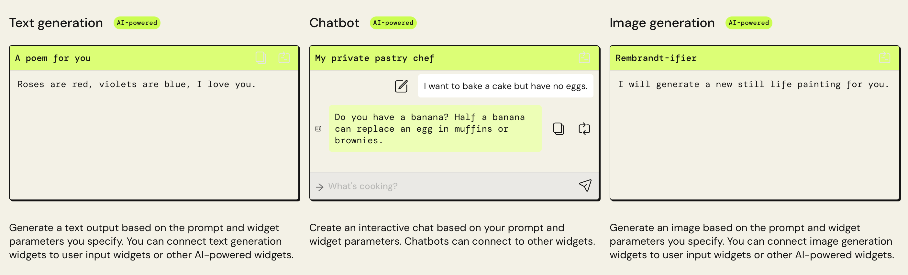
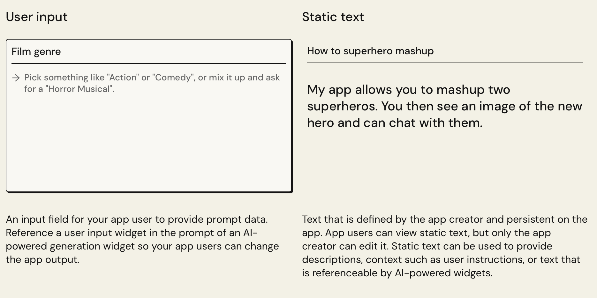
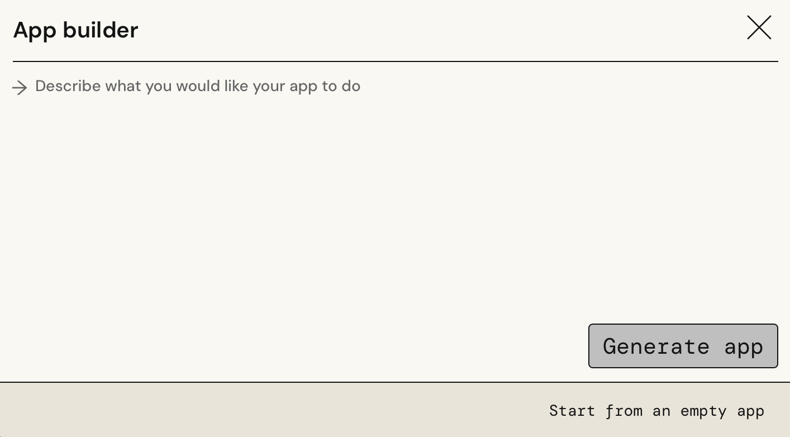
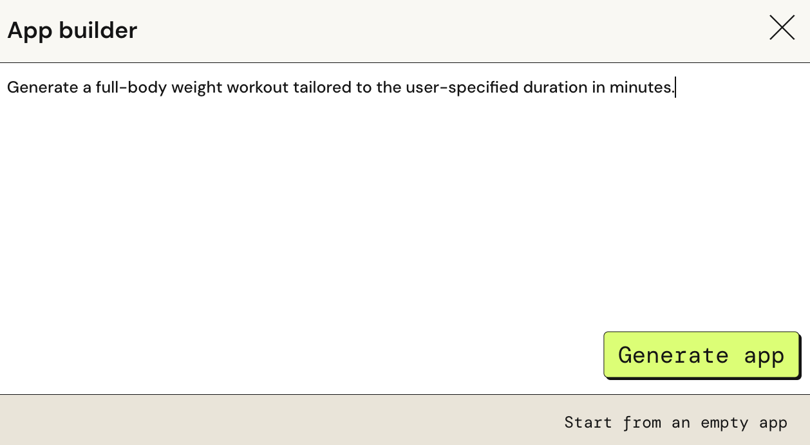
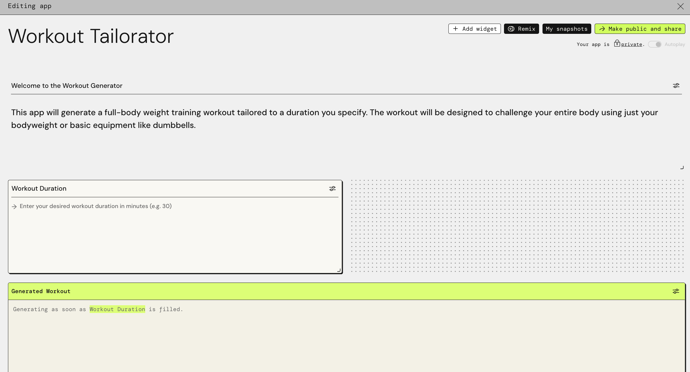
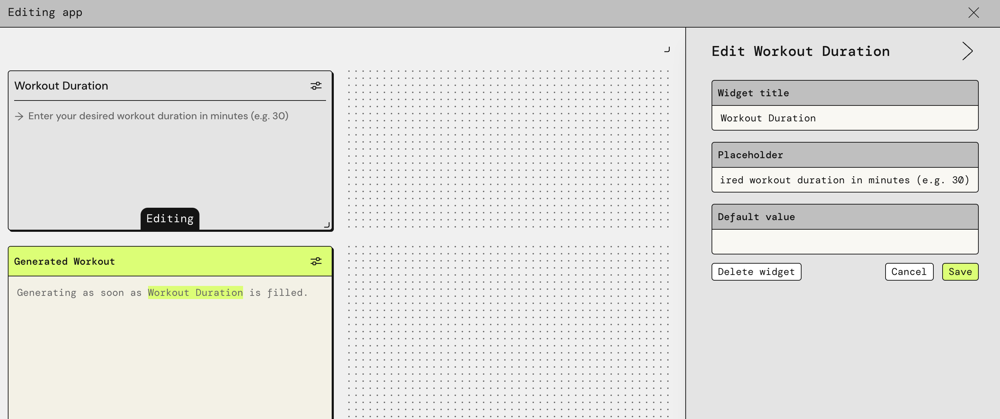
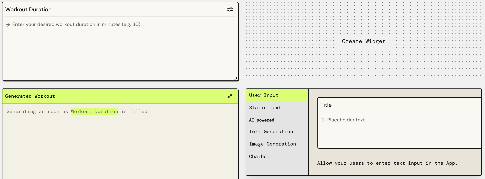
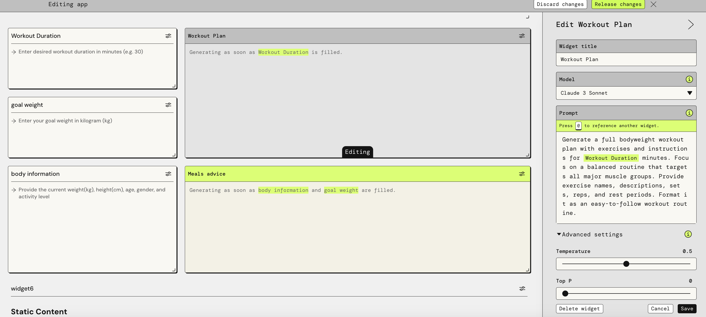
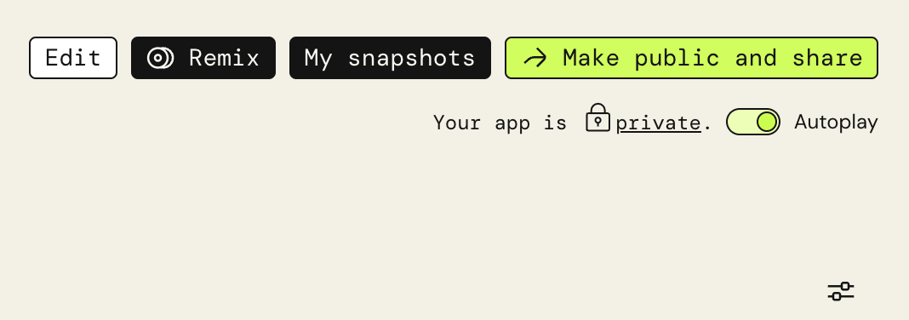
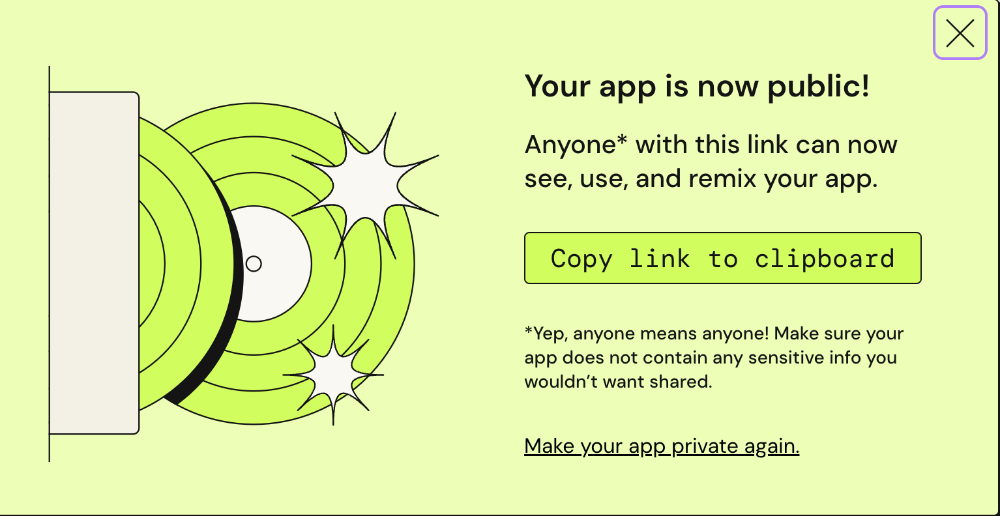

### Introduction
#### What is PartyRock?
> Amazon PartyRock is an environment that allows users to experiment with and build
> generative AI-powered applications without any coding, focusing on skills like 
> prompt engineering. It’s a fast and fun way to learn about generative AI 🕹️

#### How to use AWS PartyRock?  How does it works?
> PartyRock uses foundation models from Amazon Bedrock to turn your ideas into 
> working PartyRock apps. The platform then uses this description to create the 
> application, providing widgets and tools based on the entered prompt.
> To get the most out of the PartyRock experience, you can do the following:
> 1. Get started by creating a PartyRock app. 
> 2. Build the app by editing UI elements called widgets. You can change widget 
> prompts so that they connect to each other and accomplish different things.
> 3. Take the next steps and publish your PartyRock app and share it with others.

### Building the app
#### How does the PartyRock create an app?
> The app builder is a generative AI tool within PartyRock that can make different 
> apps for you through a process called inference. 
> * App Creation: PartyRock uses a generative AI tool to create applications based 
> on user descriptions, leveraging Amazon Bedrock's foundation models.
> * Widget Assembly: It generates instructions for app construction, detailing 
> necessary components and UI elements like text boxes and buttons.
> * Customization: In the app editor, users can customize by adjusting widget sizes
> positions, and functions to fulfill the intended app purpose.

#### What is a widget?
> Widgets in PartyRock are UI elements that can interact, display content, and 
> process input. They can be linked to create complex outputs, like text or images,
> using AI-driven prompts and data from other widgets. These AI-powered widgets 
> leverage foundation models for content generation.

#### Types of widgets
* 3 AI-powered widgets: Image generation, Chatbot, and Text generation. 
    You can edit AI-powered widgets to connect them to other widgets and make their output change.
* 2 other widgets: User input and Static text. 
  * The user input widget allow users to change output when you connect it to     AI-powered widgets. 
  * The static text widget provides a place for text descriptions.

### Let's start!

#### Enter the prompt
Enter the prompt that you want your app to do

After entering the prompt and clicking 'Create', you will receive an initial simple app.

#### Settings
Each widget can be resized and repositioned freely; clicking the settings button in the top right corner allows for editing and configuring options such as widget name, model used, temperature, etc.

Also, you can click the 'Create Widget' on the canva to create new widgets.

I putted `@Workout Duration` into the prompt, allowing the LLM to dynamically read the user's input. Additionally, I set the `temp` to 0.5, hoping to maintain a certain degree of flexibility in the LLM's responses.

* What is temperature?
  * A setting used to control the randomness of the responses generated by the model.
  * Low Temperature (e.g., closer to 0): The AI's responses are more predictable,confident, and less varied. The model sticks closely to the most likely words and phrases based on its training.
  * High Temperature (e.g., closer to 1): The AI's responses are more random and diverse. It might produce more creative or unusual outputs, as it’s more willing to choose less likely words and phrases.
* Why use temperature?
  * Temperature allows you to balance between creativity and accuracy. 
  * Adjusting the temperature setting in an AI model helps to tune how "safe" or "adventurous" the AI's responses should be, depending on what you need it for.

After completing the edits, you can click `Make Public and Share` in the top right corner of the page to publish your created app!

 

