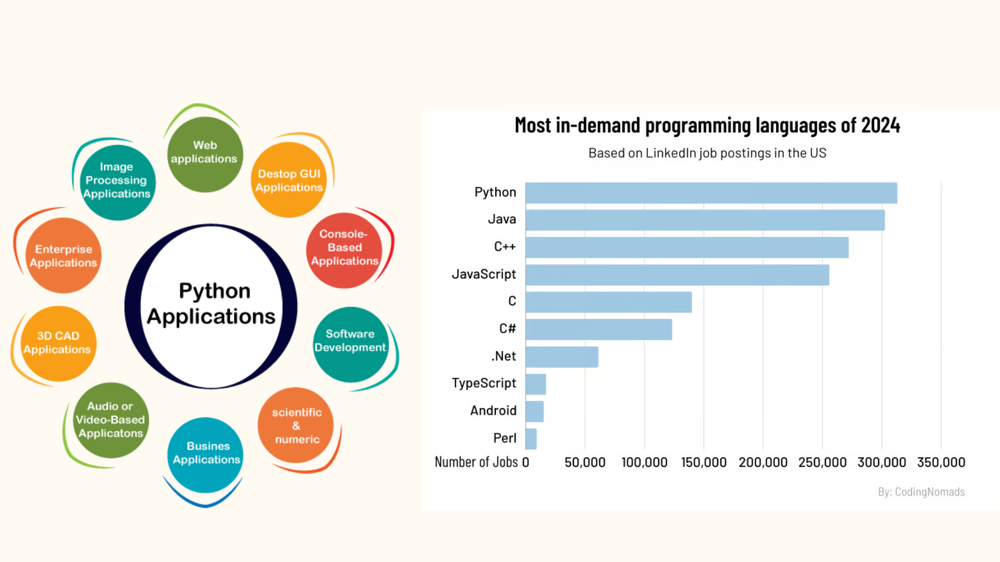
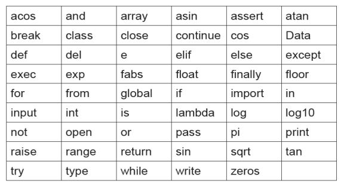
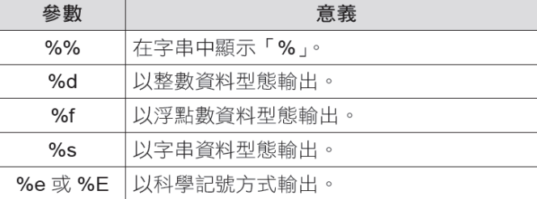
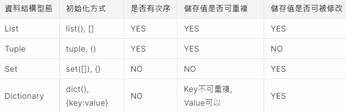
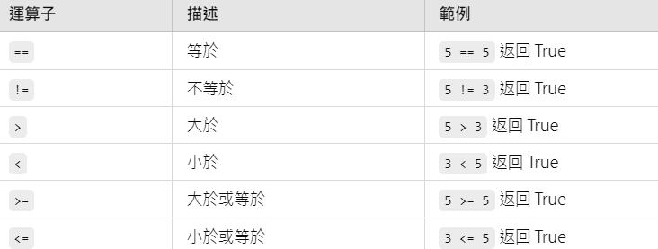
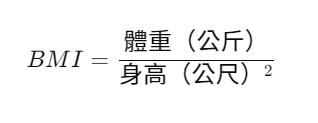
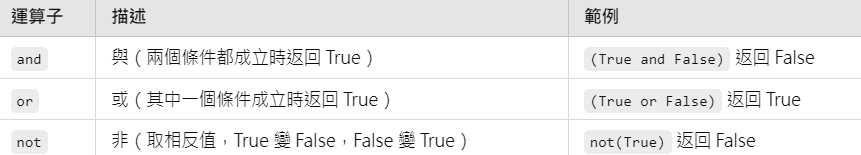
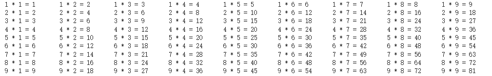
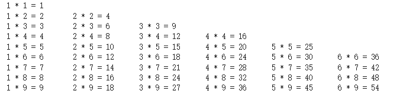

# **WHAT IS PYTHON**
Python是非常受歡迎的程式語言，因為容易閱讀和理解，且擁有龐大的開發者社群提供各種函式庫、框架以及教學課程，相對容易學習上手，適合新手入門學習的程式語言。

程式碼的可讀性高，語法接近英文，相較其它的程式語言，例如：C++或Java，Python 指令撰寫較簡潔，可以用更少的程式碼即能達到同樣的結果  
(當然Java, C都有其存在的必要性)

同時Python應用範圍非常廣泛，也是市場上工作機會需求最大的程式語言之一。


# **Python 自學資源**
> * Python 官方文檔 
> * ‍Learn Python：給非技術背景初學者入門的網站
> * DataCamp：側重於數據科學的Python教學
> * FreeCodecamp：4小時的英文初學者教程，有中文字幕
> * Google：Google’s Python Class
> * IBM：Python for Data Science, AI & Development
> * Youtube影片

# **有了AI，為何還要學python?**
> 在資料分析的過程中，的確有很多工具可以幫助我們進行數據處理、分析和視覺化，
> 甚至透過AI，可以不需要寫程式，只靠指令就能達到目的。
> 
> Python作為資料分析領域中最常用的程式語言之一，今天不僅僅是學一個工具，學習過程一種 **「思考和解決問題的方式」**。
> 當你用 Python 進行資料分析時，實際上是在鍛煉自己的邏輯思維和問題拆解能力。AI 可能能幫你建立模型，但只有人能找出為什麼模型結果不如預期，或者數據處理出現錯誤的根本原因。
> 
> 我們需要的不是更多的工具，而是對數據和邏輯的深入理解，並有能力去拆解問題、排查錯誤，找到解決辦法。
> Python 幫助你透過程式碼來一步一步進行分析、偵錯，這是一個 AI 無法完全取代的過程。
> 
> 我會認為學習不論是Python或是其他的工具， 並不是為了讓你比 AI 工具更強，而是為了讓你能在面對錯誤、困境時，有能力拆解問題，還有切入問題的方式和工具，找到解決方案💪


# 變數

> 1. 程式語言中**等號**的意思是，將等號右邊的值傳給左邊的變數。
> 比方說，牛排=160，就是把 160 這個數字放進 牛排 這個箱子裡。

當我們給變數賦值時，電腦會在記憶體裡找到一個位置來存放這個值，並且會將這個位置與變數名稱關聯起來。這樣當我們在程式中提到變數名稱的時候，電腦就能夠快速找到記憶體中的對應位置，然後取出我們存放的資料。

> 2. 命名首字需要用英文可搭配數字，基本上命變數還是建議用「 **<font color = red>駝峰式命名</font>**
」，在程式碼閱讀上會較為方便，也可以將不同單字用下底線分開ex:DAC_Class，變數名稱不能出現_以外的符號
> 
> ** 駝峰式命名: 變數名稱由多個單詞組成，第一個單詞的首字母小寫，後面每個單詞的首字母都大寫，這樣名稱就像駱駝的駝峰一樣。e.g.:TotalScore

> **變數命名規則**：
在 Python 中，變數名稱有一些基本規則：
> * 變數名稱可以包含字母、數字和底線（_）。例如：age、student_name
> * 變數名稱不能以數字開頭。例如：2name 是不合格的變數，但 name2 是合格的
> * 變數名稱區分大小寫。例如：Age 和 age 是兩個不同的變數
> * 避免使用 Python 的關鍵字作為變數名稱（例如：if、else、for 等）



# 基礎輸入與輸出
> * 輸出：使用 print() 函數將訊息顯示在執行結果。
> 
>   語法：**print(要輸出的內容)**
> * 輸入：使用 input() 函數來讓使用者輸入資料。
> 
>   語法：變數 = **input(提示文字)**。 input() 函數會等待使用者輸入資料，並將其存儲在變數中。

```python
print("Hello, World!")
```
Hello, World!

```python
name = input("請輸入你的名字：")
print("你好，" , name)
```
請輸入你的名字：abc  
你好，abc


# 資料型態
資料型態大致可以分成三大類，分別是數值型態、字串型態和容器型態。
* 數值型態：int, float, bool
* 字串型態：str, chr
* 容器型態：list, dict, tuple, set


## **數值資料型態 （Number）**
* 整數（int）：沒有小數點的數字，例如：1、100、-50。
* 浮點數（float）：帶有小數點的數字，例如：3.14、-0.001。
* 布林值(boolean) : 決定邏輯判斷，**True** 或 **False**

```python
# int 整數
x = 1
print(x)
print(type(x))
```
1  
<class 'int'>

```python
# int 整數
# float 浮點數
y = 1.5
print(y)
print(type(y))
```
1.5  
<class 'float'>
```python
# bool 布林值 True False
a = True
print(a)
print(type(a))
```
True
<class 'bool'>
```python
# 布林值通常是一個運算的結果
a = 1
b = 1
print(a==b)
```
True  
其中 a==b 是一個運算結果，會回傳 a 是否等於 b。 因為 a 的值是 1、b的值是 2，所以 a 不會等於 b。 a==b 這個布林值的值就會是 False 。

### **字串/字元資料型態 String/Character Data Types**
#### **1. 字串 string (str)**
字串資料是以單引號 (')或雙引號(")所包起來的文字資料，由一連串字元所組成。
使用單引號或是雙引號的時機沒有一定， 若是字串中本身就包含單引號或是雙引號，就可以使用另一種引號以利區別。
```python
# 布林值通常是一個運算的結果
song = 'Just the way you are'
print(song)
print(type(song))
```
Just the way you are
<class 'str'>

```python
print(" "Espresso" is a song by Sabrina Carpenter.")
```
SyntaxError: invalid syntax
其中把“Espresso”這首歌括號起來，會使 Python 認為要印出的字串為 “ “(空字串)、以及” is a song by Sabrina Carpenter.”，因而出現error。

```python
print('"Espresso" is a song by Sabrina Carpenter.')
```
"Espresso" is a song by Sabrina Carpenter.

#### **字串的處理**
1. 字串相加
```python
str1 = "Girl, you're amazing."
str2 = "Just the way you are"
print(str1 + str2)
```
Girl, you're amazing.Just the way you are

2. 重複印出字串

輸入字串與 * 再加上想要重複印出的字串即可
```python
str = "Hello"
print(str*5)
```

3. 計算字串長度

利用 len() 這個函式會回傳字串的長度
```python
str = "asdfghjklzxcvbnmqwertyuiop"
print(str)
print(len(str))
```
4. 取得字串中的某個字符
```python
word = "Python"
print(word[0])  # 第一個字元
print(word[-1])  # 最後一個字元
```
P  
H
#### **2. 字元 character (chr)**
字元就是組成字串的元素。 例如在字串 Python 中，   
'p', 'y', 't', 'h', 'o', 'n' 每個字母都是一個字元。

##### **型態轉換**


```python
# 整數轉換成浮點數
num_int = 209
num_float = float(num_int)
print(num_float)
print(type(num_float))
```
209.0  
<class 'float'>

```python
# 浮點數轉換成整數（會捨棄小數部分）
num_float = 3.1415926
num_int = int(num_float)
print(num_int)
```
3

```python
# 字串轉換成整數或浮點數
string_1 = "103"
num_int = int(string_1)
num_float = float(string_1)
print(num_int)
```
103

```python
# 布林值轉換成整數（True 為 1，False 為 0）
bool_value = False
num_int = int(bool_value)
print(num_int)
```
0

##### **Print的參數格式化**
在 Python 中，我們有時需要更靈活地控制輸出的內容，讓數字、字串等資料顯示得更符合我們的需求。  
這時候可以使用 % 進行字串格式化，這種方法就像填空題一樣，把變數的值放進我們設定的格式裡面。


```python
 # %%：顯示「%」
percentage = "顯示百分比符號：%%" % ()
print(percentage)

# %d：整數輸出
age = 25
print("我今年 %d 歲。" % age)

# %f：浮點數輸出
pi = 3.14159
print("圓周率的近似值是：%f" % pi)

# %s：字串輸出
name = "Alice"
print("你好，%s！" % name)

# %e：科學記號法輸出
large_number = 123456789
print("科學記號法表示：%e" % large_number)
```
顯示百分比符號：%  
我今年 25 歲。  
圓周率的近似值是：3.141590  
你好，Alice！  
科學記號法表示：1.234568e+08

## **容器型態(Container Datatypes)**
Python 的容器型態，也就是能夠用來存放多個資料的結構。  
這些結構讓我們可以更方便地組織和管理大量的數據。主要有四種常見容器型態：  
* List(串列)
* Tuple(元組)
* Set(集合)
* Dictionary(字典)

### **List(列表)**
* list是一個值可變、可重複、存放**有順序性**的資料結構。使用 [ ] 表示
* index從0開始。列表中的元素可以被修改、添加或刪除

> 列表可以儲存很多不同的東西，像是數字、字串，甚至是其他列表。
> 
> 它的特點是有順序，也就是說，可以依據編號（索引）來取出列表中每個元素。
> 
> 索引從 0 開始，意味著列表的第一個元素索引是 0，第二個是 1，以此類推。

```python
# 布林值轉換成整數（True 為 1，False 為 0）
student_name = ["Amy", "Bill", "Cony"]
student_score = [100, 90, 80]

print(student_name[2])
print(student_score[0])
```
Cony  
100

#### **新增/刪除/修改list的值**
* append：從List尾端新增一個元素
* insert：在List的任何位置插入元素
* remove: 將List中某個數值刪除
* pop(): 將List尾端的元素刪除
* del: 將List該位置的值刪除

建立一個List
```python
animals = ["bear", "cat", "dog", "elephant"]
```

```python
animals.append("fox") #新增一個元素"fox"
print(animals)
```
['bear', 'cat', 'dog', 'elephant', 'fox']

```python
animals.pop() #括號內不需放值，會自動刪除最後一個
print(animals)
```
['bear', 'cat', 'dog', 'elephant']

```python
animals.insert(2,"panda") #List的第二個元素在"cat"插入後變成"panda"
print(animals)
```
['bear', 'panda', 'bird', 'cat', 'dog', 'elephant']

```python
animals.remove("dog") # 刪除"dog"
print(animals)
```
['bear', 'bird', 'bird', 'cat', 'elephant']

#### **取得長度**
使用 **len(list)**
```python
student = ['Amy', 'Bill', 'Cony', 'Dora', "Ellie"]
print(len(student))
```
5

#### **常用位置函數**
* sort()：List排序
* reverse()：反轉List的順序
* index()：某值在List第一次出現的索引位置
* count()：某值在List出現的次數

建立兩個list
```python
animals = ['bear', 'cat', 'dog', 'elephant', 'cat']
num = [21, 32, 43, 54, 65, 23, 34, 35]
```

```python
#在sort中可以加入reverse參數調整升降(默認是升序)
#reverse = True 降序， reverse = False 升序
#都沒打就是默認reverse = False

animals.sort() #排序方法按照字母順序
num.sort()     #數字會按照數字小到大

print(animals)
print(num)

animals.sort(reverse = True) #排序方法按照字母順序
num.sort(reverse = True)

print(animals)
print(num)
```
['bear', 'cat', 'cat', 'dog', 'elephant']  
[21, 23, 32, 34, 35, 43, 54, 65]  
['elephant', 'dog', 'cat', 'cat', 'bear']  
[65, 54, 43, 35, 34, 32, 23, 21]  

```python
animals = ['bear', 'cat', 'dog', 'elephant', 'cat', "Cat"]
print(animals.count('cat')) #cat總共出現幾次
```
2  
cat和Cat為不同元素

### **Tuple (元組)**
Tuple是一個值不可變、可重複、存放有順序性的資料結構。使用 ( ) 表示    
⭢ **給定元素後不能改變**  

```python
animals = ('bear', 'cat', 'dog', 'elephant', 'cat')
print(animals)
print(animals[1])
```
('bear', 'cat', 'dog', 'elephant', 'cat')  
cat

```python
animals[0] = "peoele"
```
TypeError: 'tuple' object does not support item assignment    
建立了一個名為 animals 的tuple，和list一樣可以用索引取值，但是不能像list一樣去改變內容。如果嘗試更改tuple的值，會報錯。

### **Set (集合)**
Set和List最大的不同在於它**沒有順序**，也**不允許有重複的元素**。  
這就像是我們在統計數據時，希望去掉重複的部分，只保留獨一無二的資料。

* Set是一個值可變、不可重複、存放沒有順序性的資料結構。用大括號 { } 表示
* 值重複時，僅會保留一個
* 只有元素值(value)，沒有鍵值(key)。

```python
set1 = {1, 2, 3, 4, 5, 5, 6, 7, 8, 8, 9, 1}
print(set1)
```
{1, 2, 3, 4, 5, 6, 7, 8, 9}

#### **常用函數**
* add( )：新增資料
* remove( )：刪除資料
* len( )： 回傳長度
* sum( )： 回傳總和
* max( )： 回傳最大值
* min( )： 回傳最小值

```python
set2 = {1, 2, 3, 4, 5, 5, 6, 7, 8, 8, 9, 1}
#新增10, 刪除5
set2.add(100)
set2.remove(5)

print(set2)
```
{1, 2, 3, 4, 6, 7, 8, 9, 100}

```python
set2 = {1, 2, 3, 4, 5, 5, 6, 7, 8, 8, 9, 11, 11}

print("長度: %d " %len(set2))  #回傳長度
print("總和: %d " %sum(set2))  #總和
print("最大值: %d " %max(set2)) #最大值
print("最小值: %d " %min(set2)) #最小值
```
長度: 10   
總和: 56   
最大值: 11   
最小值: 1   

### **Dictionary (字典)**
Dictionary的特色是用 key 和 value 的方式來存儲資料，可以把它想像成一個電話簿，key 是名字，value 是對應的電話號碼。

* Dictionary是一個值可變、可重複、存放使用唯一識別Key的資料結構。
* 以大括號{}存放元素，每個元素是由一對「鍵值(key):元素值(value)」組合而成。  
{key1:value1, key2:value2}
* key是唯一值，如果有重複，後面的資料會覆蓋前面的資料

```python
# 初始化字典
dict_1 = {"name": "Gary", "gender": "male", "age": 28}

# 1. clear(): 清空字典
dict_1.clear()
print(dict_1)
```
{ }

```python
dict = {"name": "Gary", "gender": "male", "age": 28}

# 2. copy(): 複製字典
dict_copy = dict.copy()
print("複製的字典：", dict_copy)
```
複製的字典： {'name': 'Gary', 'gender': 'male', 'age': 28}

```python
# 3. get(): 取得指定 key 的元素值
age = dict.get("age")
print("取得的 age 值：", age)

# 4. pop(): 移除指定 key 的元素值
removed_value = dict.pop("gender")
print("移除的值：", removed_value)
print("移除後的字典：", dict)
```
取得的 age 值： 28  
移除的值： male  
移除後的字典： {'name': 'Gary', 'age': 28}

```python
dict = {"name": "Gary", "gender": "male", "age": 28}

# 5. update(): 合併字典
new_info = {"height": 175, "age": 29}  # 新的字典，用來合併
dict.update(new_info)
print("合併後的字典：", dict)

# 6. len(): 回傳字典中的 key:value 組數
length = len(dict)
print("字典的長度：", length)
```
合併後的字典： {'name': 'Gary', 'gender': 'male', 'age': 29, 'height': 175}  
字典的長度： 4

### **綜合比較**


### **資料型態綜合練習**
> 假設你正在設計一個系統來儲存顧客的基本資訊，請依據以下步驟完成：
> 
> 創建一個名為 customer 的字典，使用者會輸入姓名、性別和年齡，並將這些資訊存入一個字典中。
> 
> 1. 請使用 input() 函數，讓使用者輸入顧客的城市（city），並將其存入字典中。
> 2. 請輸出顧客的所有資訊（使用 print() 輸出整個字典）。
> 3. 該字典目前包含多少組 key:value。
> 4. 假設顧客搬家了，將顧客的城市更新為新的城市 "Taipei"。
> 5. 移除顧客的性別資訊，並顯示移除後的字典內容

```python
# 1. 創建一個名為 customer 的字典，並讓使用者輸入姓名、性別和年齡
customer = {}
customer["name"] = input("請輸入顧客的姓名：")
customer["gender"] = input("請輸入顧客的性別：")
customer["age"] = int(input("請輸入顧客的年齡："))

# 2. 請使用 input() 函數，讓使用者輸入顧客的城市，並將其存入字典中
customer["city"] = input("請輸入顧客的城市：")

# 3. 輸出顧客的所有資訊
print("\n顧客的所有資訊：")
print(customer)

# 4. 該字典目前包含多少組 key:value
print("\n字典中的 key:value 組數：", len(customer))

# 5. 顧客搬家了，將顧客的城市更新為 "Taipei"
customer["city"] = "Taipei"
print("\n更新後的顧客資訊：", customer)
print(customer)

# 6. 移除顧客的性別資訊
customer.pop("gender")
print("\n移除性別後的顧客資訊：")
print(customer)
```
請輸入顧客的姓名：dac  
請輸入顧客的性別：male  
請輸入顧客的年齡：4  
請輸入顧客的城市：tainan  

顧客的所有資訊：  
{'name': 'dac', 'gender': 'male', 'age': 4, 'city': 'tainan'}

字典中的 key:value 組數： 4

更新後的顧客資訊：  
{'name': 'dac', 'gender': 'male', 'age': 4, 'city': 'Taipei'}

移除性別後的顧客資訊：  
{'name': 'dac', 'age': 4, 'city': 'Taipei'}

# **數值和關係運算子**
Python 支援各種數值運算，這些運算能夠處理整數和浮點數等數字型態。
## **數值運算子**
```python
a = 10
b = 3

print(a + b)  # 加法
print(a - b)  # 減法
print(a * b)  # 乘法
print(a / b)  # 除法
print(a // b)  # 取整除
print(a % b)  # 取餘數
print(a ** b)  # 次方
```
13  
7  
30  
3.3333333333333335  
3  
1  
1000

## **關係運算子**
關係運算子用於比較兩個數值或變數，結果會返回布林值


```python
x = 10
y = 20

print(x == y)  # 等於
print(x != y)  # 不等於
print(x > y)   # 大於
print(x < y)   # 小於
print(x >= y)  # 大於或等於
print(x <= y)  # 小於或等於
```
False  
True  
False  
True  
False  
True  

## **複合指定運算子**
* 複合指定運算子就是為簡化此種敘述產生的運算子，將運算子置於「=」前方來取代重複的變數名稱。
* 複合指定運算子同時做了「執行運算」及「指定」兩件工件
```python
i=10

i+=5 #即 i=i+5
print(i)
```
15

## **數值運算與關係運算的綜合應用**
在實際應用中，常常會將數值運算與關係運算結合起來，對數據進行條件判斷。
```python
# 檢查一個數字是否是偶數
num = 10
is_even = (num % 2 == 0)  # 使用取餘數來判斷是否為偶數
print(f"{num} 是偶數嗎？{is_even}")

# 比較兩個數字的大小
a = 5
b = 7
result = (a + 3 > b)  # 進行數學運算後比較
print(f"a + 3 是否大於 b？{result}")
```

## **數值和關係運算綜合練習**

BMI（Body Mass Index）是一個常見的健康指標，用來衡量一個人的體重是否在正常範圍內。



```python
# 輸入身高和體重
weight = float(input("請輸入你的體重（公斤）："))
height = float(input("請輸入你的身高（公尺）："))

# 計算 BMI
bmi = weight / (height ** 2)
print("你的 BMI 是：", bmi)
```

# **邏輯判斷**
## **邏輯運算子**
Python 中有三個主要的邏輯運算子，它們用來處理布林值並進行邏輯判斷：


```python
a = True
b = False

print(a and b)  # False
print(a or b)   # True
print(not a)    # False
```

```python
a = 3  # 宣告變數a為3，此式不會有產出
print((a > 1) and (a < 5))  #True and True
print((a > 1) and (a > 5))  #True and False
print((a < 1) and (a > 5))  #False and False
print((a > 1) or (a < 5))   #True or True
print((a > 1) or (a > 5))   #True or False
print((a < 1) or (a > 5))   #False or False
print(not(a > 1))         #NOT True
```

## **If-Else條件判斷**
* if 用來檢查一個條件，如果該條件為 True，就會執行對應的程式碼。
* elif（else if）用來檢查另一個條件（當前面的條件不成立時）。
* else 當所有條件都不成立時，執行預設的動作。

```python
#if

price = 120
if price < 200 :
    print('錢夠購買') #因為目前的price小於200元，所以會執行if這一行程式
```
錢夠購買

```python
#if－else

student = 80
if student <= 70 :
    print('可以加簽')
else:
    print('人數已滿')
```
人數已滿

```python
#if-elif-else

temperature = 36.2
if temperature <=37 :
    print('體溫正常')
elif 37.5 <= temperature <38 :
    print('輕微發燒')
else :
    print('發燒')
```
體溫正常

## **多條件判斷**
* 當兩個條件同時成立時，使用 and。
* 當其中任一條件成立時，使用 or。

```python
age = int(input("請輸入你的年齡："))

if age >= 18 and age < 65:
    print("你是工作年齡段")
elif age >= 65 or age < 18:
    print("你不是工作年齡段")
```
請輸入你的年齡：23  
你是工作年齡段

## **巢狀條件判斷**
巢狀條件判斷允許我們在某些條件成立時進一步檢查更多條件。這在處理多層次的邏輯時非常有用。
```python
score = int(input("請輸入你的分數："))

if score >= 60:
    print("恭喜，你及格了！")
    if score >= 90:
        print("而且你是高分！")
    else:
        print("不過你還可以努力獲得更高分！")
else:
    print("抱歉，你沒有及格。")
```


## **條件表達式（三元運算子）**
* 條件表達式允許我們在一行中寫出簡單的條件判斷
* 用法: **值1 if 條件 else 值2**

```python
age = int(input("請輸入你的年齡："))
status = "成年人" if age >= 18 else "未成年人"
print(status)
```
請輸入你的年齡：24  
成年人

## **邏輯判斷綜合練習**
**調酒推薦系統**

> 設計一個簡單的「調酒推薦系統」，根據使用者的口味偏好，推薦一款適合的調酒：
> 
> 使用者會回答三個問題來表達他們的口味偏好：
> * 基酒選擇：Gin、Whiskey、Vodka
> * 酒感：輕 or 重
> 根據這三個問題的回答，推薦以下調酒：
> * Gin Tonic：gin/輕
> * Old Fashioned：whiskey/重
> * Cosmopolitan：vodka/輕
> * Whiskey Sour：whiskey/輕
> * Vodka Martini：vodka/重
> * Negroni：gin/重
> 系統根據使用者的選擇推薦合適的調酒。

``` python
# 1. 問使用者的偏好
base_liquor = input("你想要選擇的基酒是什麼？（gin/whiskey/vodka）：").strip().lower()
strength = input("你喜歡酒感輕還是重？（輕/重）：").strip()

# 2. 根據偏好進行推薦
if base_liquor == "gin" and strength == "輕":
    print("我們推薦：Gin Tonic（琴通寧）")
elif base_liquor == "gin" and strength == "重":
    print("我們推薦：Negroni（尼格羅尼）")
elif base_liquor == "whiskey" and strength == "輕":
    print("我們推薦：Whiskey Sour（威士忌酸酒）")
elif base_liquor == "whiskey" and strength == "重":
    print("我們推薦：Old Fashioned（舊式雞尾酒）")
elif base_liquor == "vodka" and strength == "輕":
    print("我們推薦：Cosmopolitan（柯夢波丹）")
elif base_liquor == "vodka" and strength == "重":
    print("我們推薦：Moscow Mule（莫斯科騾子）")
else:
    print("無法提供推薦，請檢查您的輸入。")
```

# **Try-Except-Finally**
## Try-Except
在發生錯誤時提供提示，而不是讓程式崩潰  
Python常見的錯誤類型:  
* ZeroDivisionError：除以零的錯誤。
* ValueError：當變量的類型不符合操作時，例如試圖將字串轉換為數字。
* TypeError：當不同類型之間進行非法操作時。
* IndexError：當試圖訪問超出範圍的列表索引時。
* KeyError：當在字典中查找不存在的鍵時。  
基本語法結構：
```python
try:
    # 可能會發生錯誤的code
except:
    # 如果發生錯誤，這裡的code會被執行
```

```python
try:
    number = int(input("請輸入一個數字："))
    result = 10 / number
    print(f"結果是：{result}")
except ZeroDivisionError:
    print("錯誤：除數不能為 0")
except ValueError:
    print("錯誤：請輸入有效的數字")
```
請輸入一個數字：0  
錯誤：除數不能為 0

## **finally - 確保一定會執行的代碼**
finally 區塊中的代碼會無論是否發生錯誤都會被執行，用於釋放資源或清理工作。
```python
try:
    # 嘗試執行的code
except:
    # 處理錯誤
finally:
    # 總是會執行的code
```

```python
try:
    # 嘗試進行簡單的除法運算
    num1 = float(input("請輸入第一個數字："))
    num2 = float(input("請輸入第二個數字："))
    result = num1 / num2
    print(f"結果是：{result}")
except ZeroDivisionError:
    print("錯誤：除數不能為 0")
except ValueError:
    print("錯誤：請輸入有效的數字")
finally:
    print("無論是否發生錯誤，這段代碼都會執行。，謝謝使用")
```
請輸入第一個數字：cool  
錯誤：請輸入有效的數字  
無論是否發生錯誤，這段代碼都會執行。

# **迴圈**
## **For Loop**
for 迴圈用於遍歷序列（如列表、字串或範圍）。每次迴圈執行時，會依次取得序列中的每個元素，直到所有元素都被處理完畢。

基本語法：
```python
for 變數 in 序列:
    # 要執行的code
```

```python
fruits = ["apple", "banana", "cherry"]

for i in fruits:
    print(i)
```
有一個裝有水果名稱的列表 ["apple", "banana", "cherry"]。我們希望能夠一次輸出這些水果的名稱。  
i就是迴圈中的一個臨時變數。每次迴圈從 fruits 列表中取出一個水果，把這個水果的值存進 i 這個變數裡，然後印出來。第一圈時，fruit 是 "apple"，第二圈時是 "banana"，最後一圈是 "cherry"。

```python
word = "python"

for letter in word: #這邊letter 使用 i 也可以
    print(letter)
```
p  
y  
t  
h  
o  
n  

```python
for i in range(5):  # 產生 0 到 4 的數字
    print(i)
# 告訴迴圈，對於 range(5) 生成的每一個數字，都把它賦值給 i，然後印出來。
# 所以這個程式會從 0 一直印到 4。
```
0  
1  
2  
3  
4

### **巢狀迴圈 Nested For Loop**
aka For loop 中還有 For loop

```python
sum = 0
for n in range(10, 20):
    for z in range(2,3):
        result = n + z
        print(f'{n} + {z} = {result}')  # 列出每個 n + z 的結果
        sum += result
print('數列總和為:', sum)  # 最後列出 sum 的總和
```
10 + 2 = 12  
11 + 2 = 13  
12 + 2 = 14  
13 + 2 = 15  
14 + 2 = 16  
15 + 2 = 17  
16 + 2 = 18  
17 + 2 = 19  
18 + 2 = 20  
19 + 2 = 21  
數列總和為: 165  

**99乘法表**
```python
# 99 乘法表
for i in range(1, 10):  # 外層迴圈，控制乘數
    for j in range(1, 10):  # 內層迴圈，控制被乘數
        print(f"{i} * {j} = {i * j}", end="\t")
    print()  # 換行
```



### **For Loop進階應用- Break**
* 如果有東西在for loop計算過程中已經滿足了，可以提前結束迴圈
* 例如，找資料、計算目標答案等，不想看到7的99乘法表

```python
# 99 乘法表
for i in range(1, 10):  # 外層迴圈，控制乘數
    for j in range(1, i + 1):  # 內層迴圈，控制被乘數
        if j > 6:  # 當被乘數大於6時，跳出內層迴圈
            break
        print(f'{j} * {i} = {i * j}', end='\t')
    print()
```



### **For Loop進階應用- Continue**
當你的 for loop 要 skip 某些東西的時候可以用
```python
# 99 乘法表
for i in range (60):
  if i % 2==0:
   continue
  print(i,end=',')

# 當 i 是偶數時，我們跳過印出的動作，這樣就只會印出奇數。
```
1,3,5,7,9,11,13,15,17,19,21,23,25,27,29,31,33,35,37,39,41,43,45,47,49,51,53,55,57,59,

## **While Loop**
while 迴圈的作用是「當某個條件成立的時候，就一直進行某種操作」。這個條件必須是一個布林值（True 或 False），當條件變為 False 時，while 迴圈就會停止，不再繼續執行。也就是說，while 迴圈每次運行都會先檢查這個條件，只有當條件為 True 時，才會進入迴圈，否則就跳過它。  
**一定要確定會停止!!!避免無窮迴圈!!!**

基本語法：
```python
while 條件(只有True/False):
    # 要執行的code
```

```python
count = 0

while count < 5:
    print(f"目前計數：{count}")
    count += 1
```
目前計數：0  
目前計數：1  
目前計數：2  
目前計數：3  
目前計數：4  
設定了一個變數 count，初始值是 0。然後我們告訴程式：只要 count 小於 5，就一直執行 while 迴圈，並且每次執行時，count 的值會自動增加 1。當 count 到達 5 時，條件變成 False，迴圈就停止了。

### **While Loop進階應用**
* **break**：提前結束迴圈
當迴圈中遇到break時，迴圈會立刻結束，並跳出迴圈的執行。

* **continue**：跳過本次迴圈，進入下一次迴圈
當迴圈中遇到continue時，會跳過本次迴圈的剩餘部分，直接進入下一次迴圈。

```python
# break
number = 0
while number < 10:
    if number == 5:
        break  # 遇到數字 5 時終止迴圈
    print(number)
    number += 1
```
0  
1  
2  
3  
4  
5  

```python
# continue
number = 0
while number < 5:
    if number == 2:
        number += 1  # 注意：在 continue 前必須手動更新 number，避免無限迴圈
        continue  # 當數字是 2 時跳過這次迴圈
    print(number)
    number += 1
```
0  
1  
3  
4  

### **Loop 課堂練習1**

練習利用迴圈來計算 n!總和

* 輸入:任意數字n
* 輸出:n!的結果

階乘定義：
* 階乘（factorial）是所有從 1 到 n 的整數相乘的結果，記作 n!。
* 例如：5! = 5 * 4 * 3 * 2 * 1 = 120
* 注意：0! = 1

```python
n = int(input("請輸入 n: "))
factorial = 1
count = 1

# 使用 while 迴圈計算 n!
while count <= n:
    factorial *= count
    count += 1

# 輸出結果
print(f"{n}! = {factorial}")
```
請輸入 n: 7  
7! = 5040

### **Loop 課堂練習2**

**數字猜猜樂**

設計一個數字猜測遊戲，要求如下：

* 電腦會隨機生成一個 1 到 100 的數字。
* 使用者最多可以猜測 5 次。
* 每次猜測時，電腦會提示數字是「太大了」或「太小了」。
* 如果使用者猜對了，遊戲立即結束並顯示「猜對了！」。
* 如果 5 次都沒猜對，顯示正確答案並結束遊戲。

hint: 生成隨機數可用套件random

```python
import random

# 1. 生成隨機數
secret_number = random.randint(1, 100)

# 2. 最多猜 5 次
for attempt in range(1, 6):
    # 3. 提示使用者輸入數字
    guess = int(input(f"請輸入你的猜測（第 {attempt} 次，1-100）："))

    # 4. 使用 while 檢查是否輸入有效範圍內的數字
    while guess < 1 or guess > 100:
        print("數字必須在 1 到 100 之間！")
        guess = int(input(f"請重新輸入你的猜測（第 {attempt} 次，1-100）："))

    # 5. 比較使用者的猜測與隨機數
    if guess < secret_number:
        print("太小了！")
    elif guess > secret_number:
        print("太大了！")
    else:
        print(f"恭喜你猜對了！答案是 {secret_number}")
        break  # 結束迴圈
else:
    # 如果 5 次內沒猜對
    print(f"很遺憾，正確答案是 {secret_number}")
```