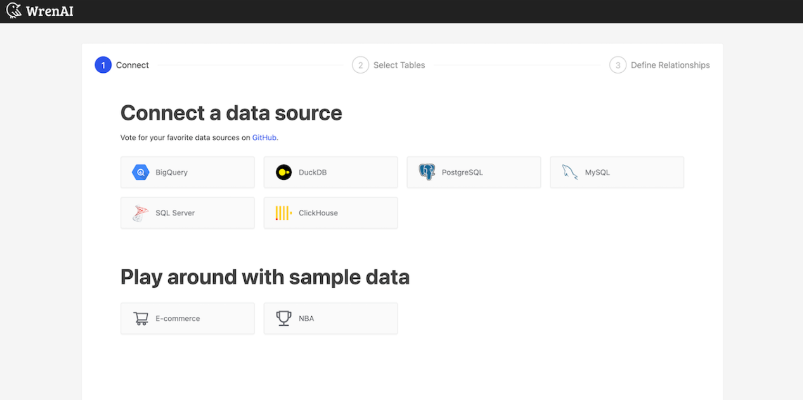
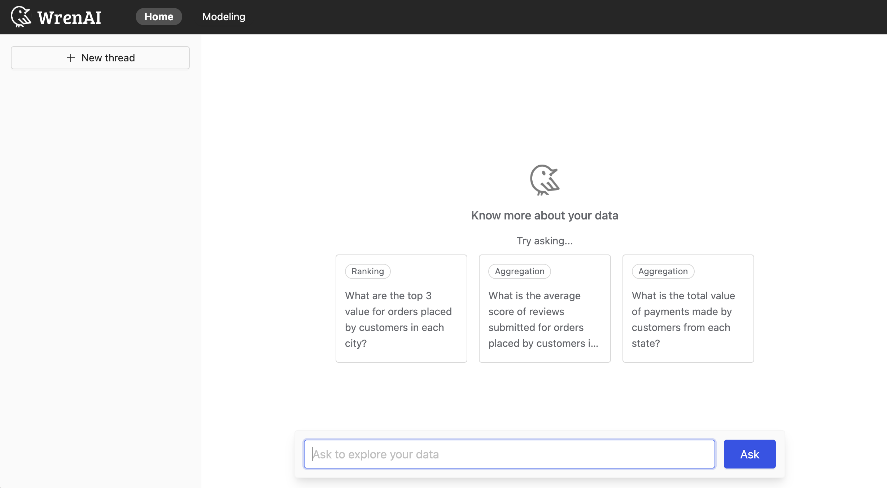
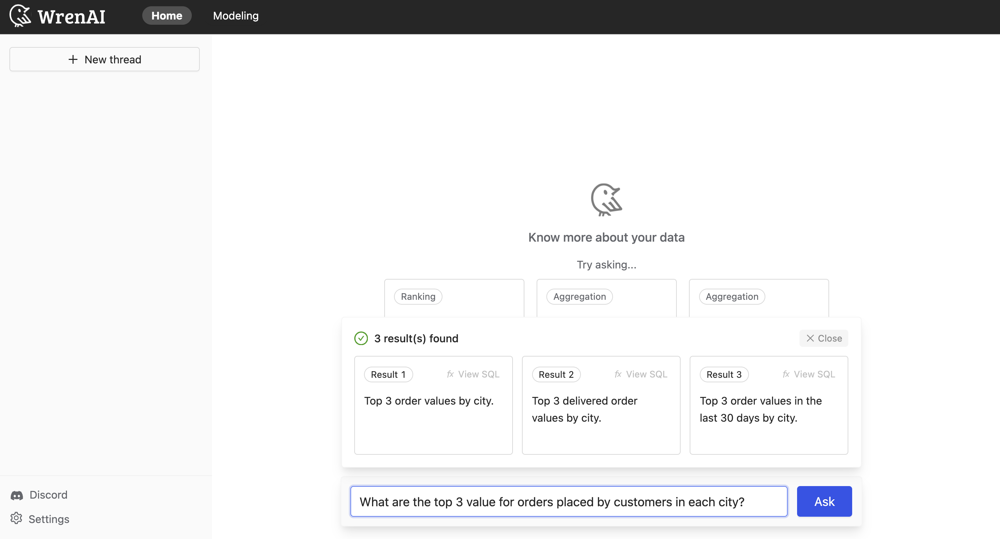
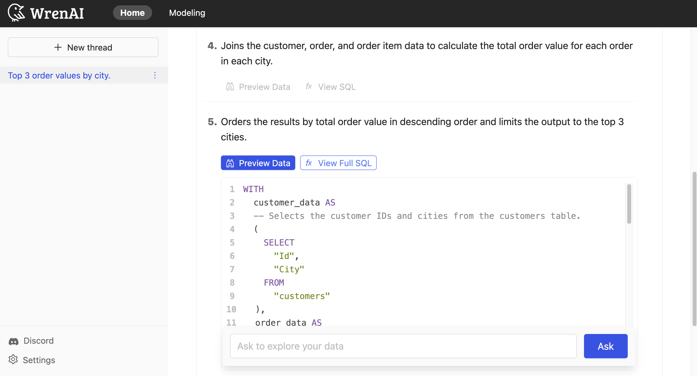

### Introducing WrenAI
Support with popular databases, data warehouses, and analytics tools!
#### About WrenAI
* `Interactive Experience`: Designed to engage users in a dialogue, clarifying queries and refining results in real time. This interactivity ensures that the generated SQL queries accurately reflect the user's intent, making the data querying process more intuitive and user-friendly.
* `Explainability`: It ensures every SQL query generated in natural language is accurate, concise, and reliable. 
* `Interoperability`: It enables users to query data from multiple sources without dealing with the complexities of different data formats and dialects, providing a standard interface across different sources.


#### How WrenAI works?
WrenAI is consist of three core services
* `Wren UI`: An intuitive user interface for asking questions, defining data relationships, and integrating data sources within WrenAI's framework.
* `Wren AI Service`: Processes queries using a vector database for context retrieval, guiding LLMs to produce precise SQL outputs.
* `Wren Engine`: Serves as the platform's backbone, managing metadata and connecting to data sources, while preparing for future application integrations.

### Getting Start!
#### Installation
`Prerequisites`
1. Install Docker Desktop on local computer
2. Prepare an OpenAI API key

`Using WrenAI Launcher`
* Mac OSX
Execute following commands in the terminal
``` bash
curl -L https://github.com/Canner/WrenAI/releases/latest/download/wren-launcher-darwin.tar.gz | tar -xz && ./wren-launcher-darwin
```

1. Run the program
2. Enter OpenAI API key
3. Wait for the installation to finish.
Program will setup docker containers for you and open the application URL in the browser for you after installation.
4. Open [localhost:3000](http://localhost:3000) to start using if the launcher program doesn't open the URL 


#### Start with sample data
Wren AI offers 2 sample datasets:
* [E-commerce](https://www.kaggle.com/datasets/olistbr/brazilian-ecommerce)
* NBA (2022 NBA playoff games)

Take E-commerce dataset for example to show following steps:
1. Click on the E-commerce option

2. Ask a question
Ask any questions related to the dataset, Wren AI will provide 1~3 results from the dataset that best answer the question.

(a) Try a sample question:
Choose "What is the average score of reviews submitted for orders placed by customers in each city?"


(b)Choose a Result


(c)
View the SQL plan description, data preview and the SQL statements in each step based on the selected result




